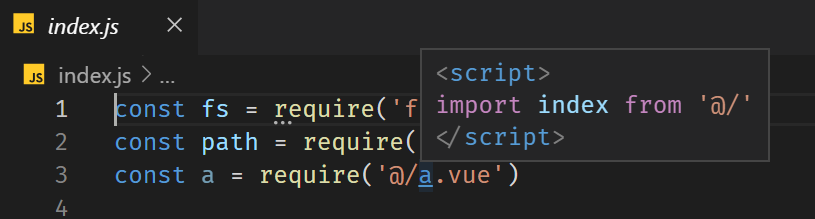

# Jump Jump Jump README

该插件作为 VS Code 文件跳转功能的补充。

加入了 对于 `@/index` 这种路径的跳转功能。

欢迎到 [github](https://github.com/FlyingFatPenguin/JumpJumpJump) 提交意见或建议。

## Features

该插件作为对 VS Code 基础功能的增强。

出现在代码中任何位置的字符串都将被视为可以跳转的路径，只要对应的文件确实存在，按住`Ctrl`键即可触发。

同时，简单的增加了将 `@` 替换为 `src` 的功能，后续将优化这个功能。

## Extension Settings

后续补充

## Known Issues

后续补充

## Release Notes

后续补充

-----------------------------------------------------------------------------------------------------------

